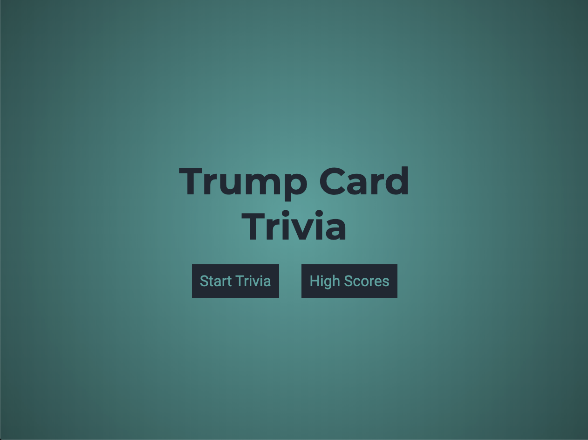
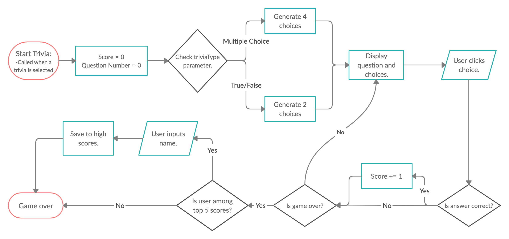

# Trump Card Trivia

[Here's a link to the game](https://qusaifares.github.io/trivia/)

## Introduction

Trump Card Trivia is a self scoring trivia game. I wanted a fun trivia game but also wanted to include more than one different trivia category, which is why I developed this web appication with the goal of making it easy to add more trivias.
Trump Card Trivia is a great app if you're looking for some fun or a couple laughs with some silly game modes.

## User Stories

**Who is Trump Card Trivia For?** Trump Card Trivia is for users who are looking to play a fun trivia game and create their own trivias for their friends to try.

## Planning

As a software engineer, you should plan every step of the way to getting your program to do what it's supposed to. I made sure to put a plan down on my end goal and break it down into smaller and simpler steps.

This is the breakdown I had set for how I want a trivia to function from start to end.

## How it Works

For a higher quality video, I suggest checking out **demonstration.mov** in this repository.

The user selects the trivia they want and answer questions which come in either multiple choice or true/false. Compete to stay on top of the table in the high scores list.

## Features

- **Bronze/Minimum Viable Product:**
  - [x] Renders in browser
  - [x] Application deployed via GitHub Pages
  - [x] Clickable answer buttons
- **Silver:**
  - [x] Basic menu and trivia animations
  - [x] Mobile responsive design
- **Gold:**
  - [x] Have more than one trivia
  - [x] Have different question types (True/False vs Multiple Choice)
  - [x] Separate high score tables for different trivias
  - [ ] Premium styling and animations
- **Platinum:**
  - [ ] Ability for users to create their own trivias

## Technologies Used

- HTML5
- CSS3
- JavaScript

## Useful Resources

Creating this application drove me to grow as a software engineer. I ran into many obstacles but thankfully always came to a solution by searching on sites like MDN and Stack Overflow.

I was also able to organize my work and plan ahead by using [Trello](https://trello.com/) which was suggested by Esin, one of my instructors.

I also have to mention [Traversy Media](https://www.youtube.com/channel/UC29ju8bIPH5as8OGnQzwJyA) on YouTube. I found his content very informative and well put together.

## Gratitude

I'd like to thank my instructors at General Assembly (Jared, Hou, Esin, Jerrica, Jennifer), I feel my growth as a developer has been smooth and quick thanks to them.

I'd also like to thank my colleagues for being very cooperative and helpful.

Finally thanks to my siblings for helping me with some of the questions in these trivias.
